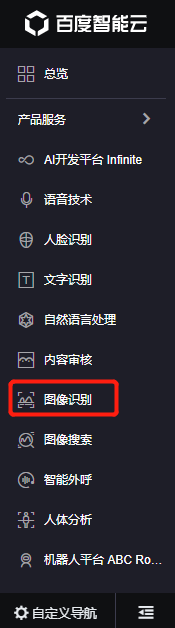
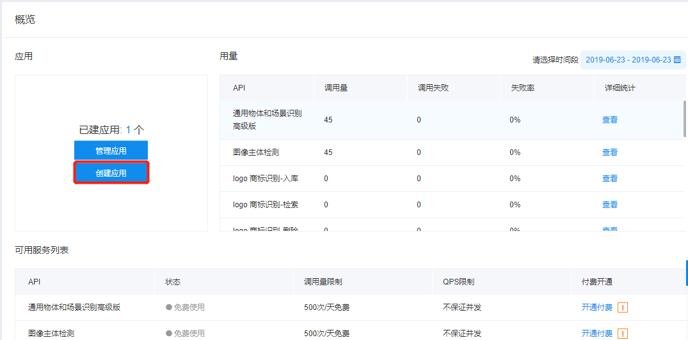
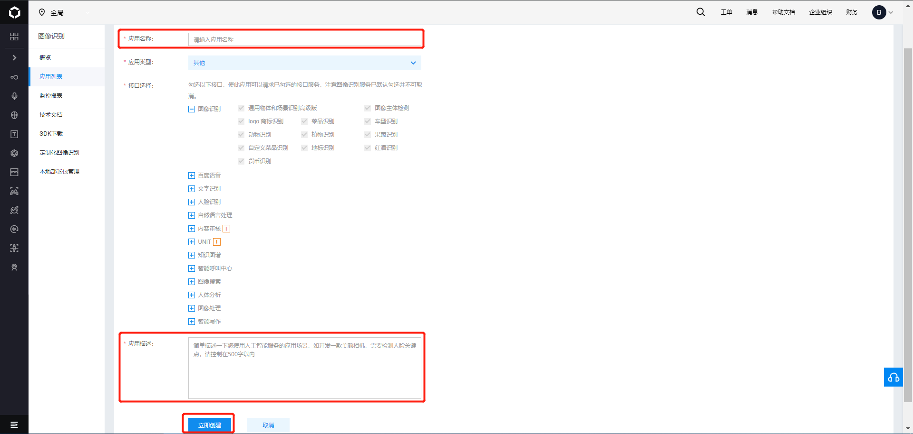
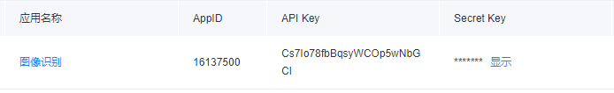
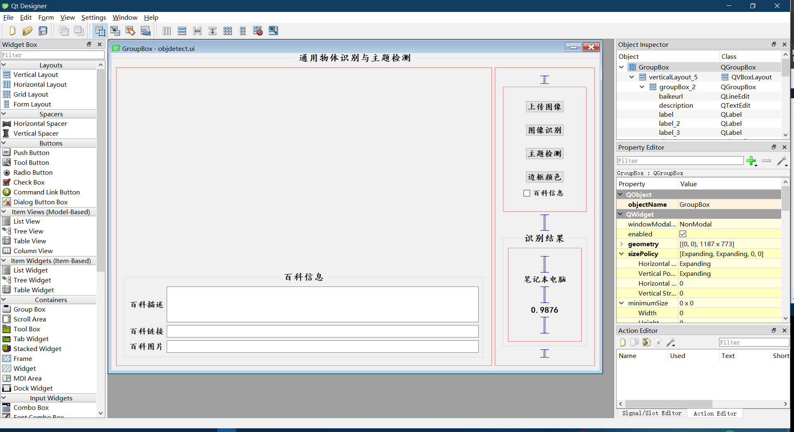
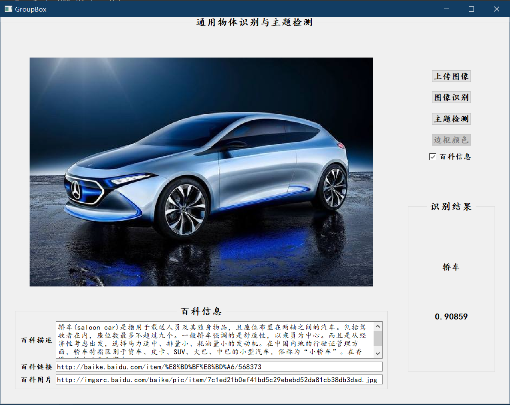
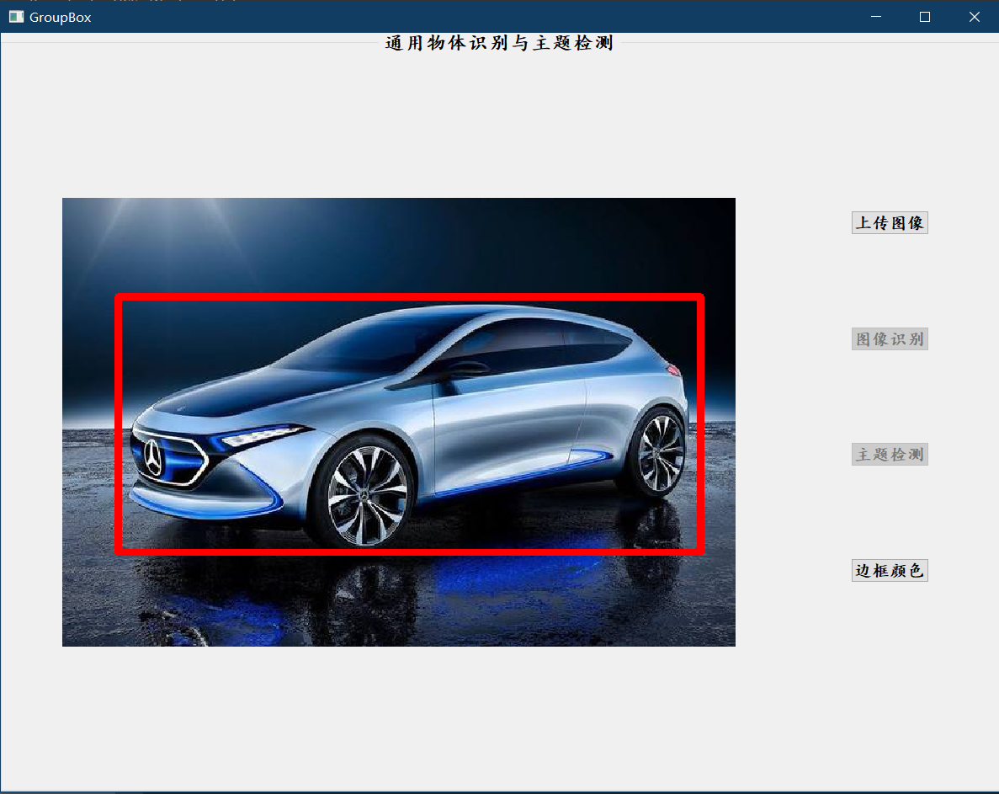

# 第三期 【百度大脑新品体验】 通用物体与场景识别

## API 介绍

通用物体与场景识别支持超过 10 万类常见物体和场景识别，接口返回图片内 1 个或多个物体的名称，并可获取百科信息。适用于图像或视频内容分析、拍照识图等业务场景。

支持识别动物、植物、商品、建筑、风景、动漫、食材、公众人物等10万个常见物体及场景，接口返回大类及细分类的名称结果。

### 接口描述

该请求用于通用物体及场景识别，即对于输入的一张图片（可正常解码，且长宽比适宜），输出图片中的多个物体及场景标签。

### 请求说明

#### 请求 url

https://aip.baidubce.com/rest/2.0/image-classify/v2/advanced_general

#### 请求参数

|参数|是否必选|类型|可选值范围|说明|
|:---:|:---:|:---:|:---:|:---:|
|image|true|string|-|Base64编码字符串，以图片文件形式请求时必填。|
|baike_num|否|integer|0-5|返回百科信息的结果数，默认为0，不返回；2为返回前2个结果的百科信息，以此类推。|

### 返回说明

#### 返回参数

|字段|是否必选|类型|说明|
|:---:|:---:|:---:|:---:|
|log_id|是|uint64|唯一的log id，用于问题定位|
|result_num|是|uint32|返回结果数目，及result数组中的元素个数|
|result|是|arrry(object)|标签结果数组|
|+keyword|是	|string|图片中的物体或场景名称|
|+score|是|float|置信度，0-1|
|+root|是|string|识别结果的上层标签，有部分钱币、动漫、烟酒等tag无上层标签|
|+baike_info|object|否|对应识别结果的百科词条名称|
|++baike_url|string|否|对应识别结果百度百科页面链接|
|++image_url|string|否|对应识别结果百科图片链接|
|++description|string|否|对应识别结果百科内容描述|

#### 返回实例

```python
{
	"log_id": "1418961236584752678",
	"result_num": 5,
	"result": [
		{
			"score": 0.764778,
			"root": "商品-电脑办公",
			"baike_info": {
				"baike_url": "http://baike.baidu.com/item/%E7%AC%94%E8%AE%B0%E6%9C%AC%E7%94%B5%E8%84%91/213561",
				"image_url": "http://imgsrc.baidu.com/baike/pic/item/63d0f703918fa0ec125a44b4269759ee3c6ddbed.jpg",
				"description": "笔记本电脑(NoteBook Computer，简称为：NoteBook)，亦称笔记型、手提或膝上电脑(英语：Laptop Computer，简称为Laptop)，是一种小型、可方便携带的个人电脑。笔记本电脑的重量通常重1－3千克。其发展趋势是体积越来越小，重量越来越轻，而功能却越来越强大。像Netbook，也就是俗称的上网本。笔记本电脑跟PC的主要区别在于其便携带性。"
			},
			"keyword": "笔记本电脑"
		},
		{
			"score": 0.526428,
			"root": "商品-电脑办公",
			"keyword": "电脑"
		},
		{
			"score": 0.354558,
			"root": "商品-电脑办公",
			"keyword": "笔记本"
		},
		{
			"score": 0.181704,
			"root": "商品-数码产品",
			"keyword": "台式电脑"
		},
		{
			"score": 0.008778,
			"root": "商品-数码产品",
			"keyword": "平板电脑"
		}
	]
}
```

## 接口调用实现

### 获取 access_token

要调用百度 AI API 的接口，需要创建对应的应用并获取 access_token.

#### 创建应用

首先登陆百度 AI 控制台（https://console.bce.baidu.com/?fromai=1#/aip/overview），然后点击右侧导航栏里面的 “图像识别”。



然后点击创建应用



填好“应用名称”和“应用描述”后点击“创建应用”。



创建好应用之后，进入“应用列表”，就能看到应用的相关信息，我们需要的是 API Key 和 Secret Key。



#### 获取 access token

通过 API Key 和 Secret Key 获取的 access_token。更多关于 access_token 的获取方法参考 http://ai.baidu.com/docs#/Auth/top。

下面代码是 python3 获取 access_token 的代码

```python
import requests

def get_token_key():
    # client_id 为官网获取的AK， client_secret 为官网获取的SK
    client_id = '【百度云应用的AK】'
    client_secret = '【百度云应用的SK】'
    url = f'https://aip.baidubce.com/oauth/2.0/token?grant_type=client_credentials' \
        f'&client_id={client_id}&client_secret={client_secret}'
    headers = {'Content-Type': 'application/json; charset=UTF-8'}
    res = requests.post(url, headers=headers)
    token_content = res.json()
    assert "error" not in token_content, f"{token_content['error_description']}"
    token_key = token_content['access_token']
    return token_key
```

### 调用通用物体与场景识别接口

通用物体与场景识别接口类及调用的 python3 代码实现如下：

```python
import requests
from utils import pic_base64, draw_zh, get_token_key

class General(object):

    def __init__(self, image_base64, token_key, baike_num=0):
        self.image_base64 = image_base64
        self.token_key = token_key
        self.baike_num = baike_num
        self.data = self.get_data()

    def get_data(self):
        request_url = "https://aip.baidubce.com/rest/2.0/image-classify/v2/advanced_general"
        params_d = dict()
        params_d['image'] = str(self.image_base64, encoding='utf-8')
        params_d['baike_num'] = self.baike_num
        access_token = self.token_key
        request_url = request_url + "?access_token=" + access_token
        res = requests.post(url=request_url,
                            data=params_d,
                            headers={'Content-Type': 'application/x-www-form-urlencoded'})
        data = res.json()
        assert 'error_code' not in data, f'Error: {data["error_msg"]}'
        return data

    def get_result_num(self):
        return self.data['result_num']

    def get_log_id(self):
        return self.data['log_id']

    def get_result(self):
        return self.data['result']

    def parse_data(self):
        result_num = self.get_result_num()
        result = self.get_result()
        res = list()
        for i in range(result_num):
            if i < self.baike_num:
                res.append((result[i]['keyword'], result[i]['score'], result[i]['baike_info']))
            else:
                res.append((result[i]['keyword'], result[i]['score'], None))
        return res
        
        
def detect(image_name, color):
    token_key = 'your token key'
    # image_name = 'images/001.png'
    image = cv2.imread(image_name)
    image_base64 = pic_base64(image_name)
    general = General(image_base64, token_key, 1)
    obj = ObjectDetect(image_base64, token_key)
    general_data = general.parse_data()
    bbox = obj.parse_data()
    name = general_data[0][0]
    score = general_data[0][1]
    baike = general_data[0][2]
    image = obj.draw_bbox(image, color)
    # draw_zh(image, name, bbox[0], bbox[1] - 16, color)
    cv2.cvtColor(image, cv2.COLOR_BGR2RGB, image)
    return image, name, score, baike
```

## QT 实现界面展示

首先使用 qtdesigner 设计好界面，同时创建好按钮的槽函数，界面的设计如下图所示：



然后将 `.ui` 文件通过 PyUIC 转换为 `.py` 文件，并在生成的 `.py` 文件中添加槽函数的实现，具体的代码如下：

**”上传图像“按钮对应的代码**

```python
def on_upload_clicked(self):
    self.groupBox.setVisible(False)
    self.pushButton.setEnabled(False)
    fname = QtWidgets.QFileDialog.getOpenFileName(QtWidgets.QWidget(), 'Open file', self.file_path,
                                                  'Image file (*.jpg *.gif *.png)')
    if fname[0] != '':
        self.file_path = os.path.dirname(fname[0])
        self.imagePath = fname[0]
    pixmap = QtGui.QPixmap(self.imagePath)
    height, width = pixmap.height(), pixmap.width()
    if width > height:
        pixmapscared = pixmap.scaledToWidth(800)
    else:
        pixmapscared = pixmap.scaledToHeight(600)
    self.label_img.setPixmap(pixmapscared)
    # self.label_img.setScaledContents(True)
    self.detect.setEnabled(True)
    self.pushButton_2.setEnabled(True)
```

**“图像识别”按钮对应的代码** ，该代码实现了图像通用物体与场景识别。

```python
def on_recognition_clicked(self):
    self.isbaike.setVisible(True)
    str_warm = '未查到相关信息'
    img, name, score, baike = detect(self.imagePath, self.color)
    pixmap = QtGui.QPixmap(self.imagePath)
    height, width = pixmap.height(), pixmap.width()
    if width > height:
        pixmapscared = pixmap.scaledToWidth(800)
    else:
        pixmapscared = pixmap.scaledToHeight(600)
    self.label_img.setPixmap(pixmapscared)
    self.groupBox.setVisible(True)
    # self.label_img.setScaledContents(True)
    self.cls.setText(name)
    self.score.setText(str(score))
    self.detect.setEnabled(True)
    if baike:
        self.description.setText(baike['description'])
        self.baikeurl.setText(baike['baike_url'])
        self.picurl.setText(baike['image_url'])
    else:
        self.description.setText(str_warm)
        self.baikeurl.setText(str_warm)
        self.picurl.setText(str_warm)
```

**“主体检测”按钮对应的代码** ，该代码实现了图像主体检测

```python
def on_detect_clicked(self):
    self.groupBox.setVisible(False)
    self.groupBox_2.setVisible(False)
    self.pushButton_2.setEnabled(False)
    self.isbaike.setVisible(False)
    self.cls.setText(" ")
    self.score.setText(" ")
    img, name, score, _ = detect(self.imagePath, self.color)
    height, width, bytesPerComponent = img.shape
    bytesPerLine = bytesPerComponent * width
    Qimg = QtGui.QImage(img.data, width, height, bytesPerLine, QtGui.QImage.Format_RGB888)
    pixmap = QtGui.QPixmap.fromImage(Qimg)
    if width > height:
        pixmapscared = pixmap.scaledToWidth(800)
    else:
        pixmapscared = pixmap.scaledToHeight(600)
    self.label_img.setPixmap(pixmapscared)
    # self.label_img.setScaledContents(True)
    self.detect.setEnabled(False)
    self.pushButton.setEnabled(True)
```

**“边框颜色”按钮对应的代码，** 该代码实现了改变主体检测中主体边框的颜色

```python
def on_choose_color(self):
    self.groupBox.setVisible(False)
    color = QtWidgets.QColorDialog.getColor()
    self.color = color.getRgb()[:3]
    from detectimage import detect
    img, name, score, _ = detect(self.imagePath, self.color)
    height, width, bytesPerComponent = img.shape
    bytesPerLine = bytesPerComponent * width
    Qimg = QtGui.QImage(img.data, width, height, bytesPerLine, QtGui.QImage.Format_RGB888)
    pixmap = QtGui.QPixmap.fromImage(Qimg)
    if width > height:
        pixmapscared = pixmap.scaledToWidth(800)
    else:
        pixmapscared = pixmap.scaledToHeight(600)
    self.label_img.setPixmap(pixmapscared)
    # self.label_img.setScaledContents(True)
    self.cls.setText(" ")
    self.score.setText(" ")
```

## 实例运行效果图





## 代码打包

可以使用 pyinstaller 将代码打包

首先安装 pyinstaller

```bash
pip install pyinstaller
```

然后将代码打包

```bash
pyinstaller ruun.py
```

最终会在主文件下生成 dist 文件夹和 build 文件夹，可执行文件在 dist 文件夹下。

## 源码地址

* 源代码：[https://github.com/busyboxs/qt-baidu-image-recognizition](https://github.com/busyboxs/qt-baidu-image-recognizition)

* 可执行文件链接：[https://pan.baidu.com/s/11J09VeWzl2W2pcNeHz0Ovw](https://pan.baidu.com/s/11J09VeWzl2W2pcNeHz0Ovw) 提取码：tm9i 

可执行文件路径 `~/BaiDuDetect/dist/ruun/ruun.exe`
